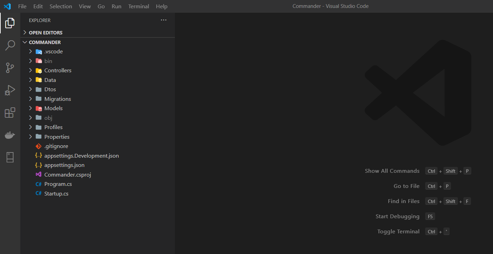
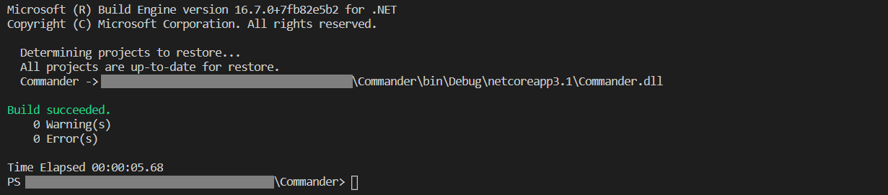
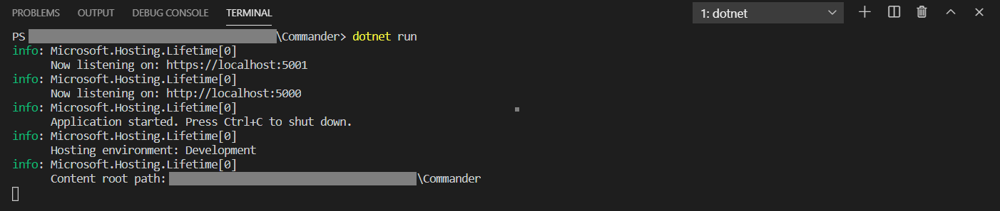

# Commander API
> Commander API is a simple ASP.NET Core 3.1 MVC REST API that executes CRUD (Create, Retrieve, Update and Delete) commands on an MS SQL Server Database using Entity Framework Core.


<br/><br/>

## Description
The Commander API stores command line snippets (e.g. dotnet new mvc - to create a new ASP.NET Core Web Application). 
It is a simple but useful tool when you need to find a specific command line to use it. So, you'll have it within your reach, quickly and without having to perform any search on Google ;).

Each command line will have the following attributes:

- How to<br/>
Description of what the command will do, e.g. Build a .NET the project

- Command line<br/>
The actual command line snippet, e.g. dotnet build

- Platform<br/>
Application or platform domain, e.g. .Net Core


### Features

- [X] Retrieve all commands
- [X] Retrieve a spectic command
- [X] Create a new command
- [X] Update a command information
- [X] Delete an existent command

<br/>
As the most REST APIs, the Commander API will follow the standard set of methods to Create, Retrieve, Update, and Delete records in the database. So, each functionality could be access as listed in the table below:

<table>
  <tbody>
    <tr>
      <th>Verb</th>
      <th>URI</th>
      <th>Method</th>
      <th>Description</th>
    </tr>
    <tr>
      <td>GET</td>
      <td>/api/commands</td>
      <td>Retrieve</td>
      <td>Retrieve all command line</td>
    </tr>
    <tr>
      <td>GET</td>
      <td>/api/commands/{id}</td>
      <td>Retrieve</td>
      <td>Retrieve a single resource, (by Id)</td>
    </tr>    
    <tr>
      <td>POST</td>
      <td>/api/commands</td>
      <td>Create</td>
      <td>Create a new command line</td>
    </tr>
    <tr>
      <td>PUT</td>
      <td>/api/commands/{id}</td>
      <td>Update</td>
      <td>Update a single command line by Id</td>
    </tr>
    <tr>
      <td>DELETE</td>
      <td>/api/commands/{id}</td>
      <td>Delete</td>
      <td>Delete a single command line by Id</td>
    </tr>
  </tbody>
</table>


## Installation

### Pre-requisites

1. .Net Core SDK installed;
2. Visual Studio Code installed;
3. Microsoft SQL Server Local DB installed;
4. MS SQl Server - VSCode Extension - installed.

### Cloning the Repository

1. Create a project's directory on your computer;
2. Clone the repository.

```bash
git clone https://github.com/savaladaojr/CommanderAPI
```

## Running the API

#### Opening the project

1. On the director that you clone the repository, by a command prompt, execute the command to open the Visual Sutdio Code and load the project folder.
You should see something like the screenshot below.

```sh
code .
```



### Restoring project's dependencies

1. In the Visual Studio Code, open a *Terminal* and run the command to restore all packages used by the API;

```sh
dotnet restore
```

### Updating the Database

1. Connect on the SQL Server Local DB:<br/>
1.1. Create a new database "CommanderDB";<br/>
1.2. Create new user called "CommanderUser", set it password and set it as a CommanderDB owner;<br/>

2. In the VSCode:<br/>
2.1. Open the file *"appsettings.json"* and change the *"ConnectionString"* property to reflect your configuration;<br/>
2.2. Open a new Terminal and run the command to update the database with the project's database migrations.<br/>

```sh
dotnet ef database update
```

### Building & Runnin the API

1. Then rebuild the application;

```sh
dotnet build
```


2. Run the API.

```sh
dotnet run
```



## Consuming the API.

To run some tests on the API, I recommend that you download [Postman](https://www.postman.com/downloads/) or also use a Google Chrome plug-in. You also have another option which is [Insomina](https://insomnia.rest/download/). Both are gonna work and have a free version.

I'm using Postman! So I have already prepared a file with all requests for the API. You can find this file (Commands API.postman_collection.json) in the repository.

Exemple of a request to the API:


<br/><br/><br/>


## Contributing

1. Fork it (<https://github.com/savaladaojr/CommanderAPI/fork>);
2. Create your feature branch (e.g. `git checkout -b feature/fooBar`);
3. Commit your changes (e.g. `git commit -am 'Add some fooBar'`);
4. Push to the branch (e.g. `git push origin feature/fooBar`);
5. Create a new Pull Request.

<br/><br/><br/><br/><br/>
###### This API was built for learning purposes. I did follow the instructions from the <a href='https://dotnetplaybook.com/develop-a-rest-api-with-net-core/'>Dotnetplaybook</a> website.
